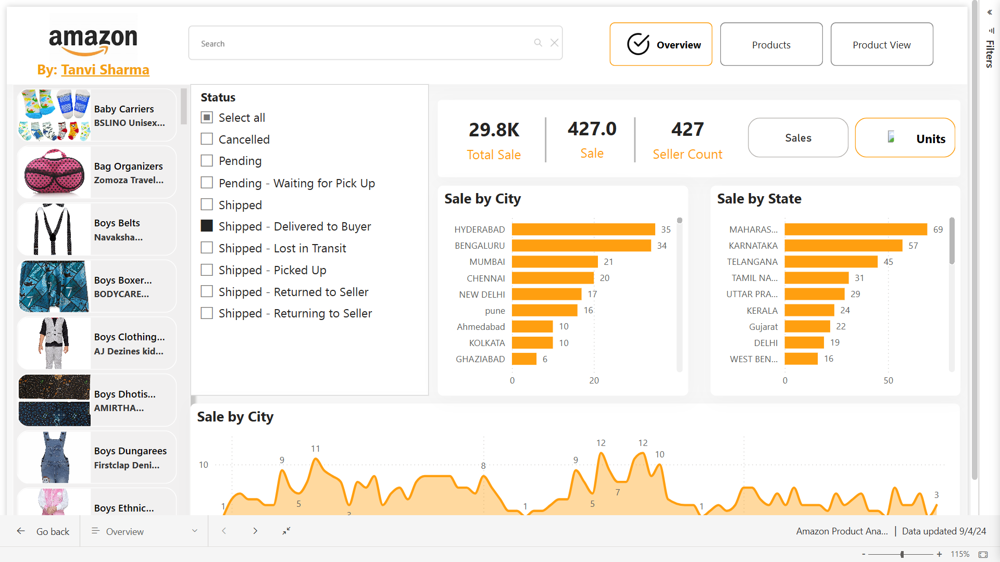

# Amazon Product Analysis Power BI Dashboard



## Overview

This repository contains a dynamic dashboard created using Power BI to analyze Amazon apparel sales data. The dashboard provides comprehensive insights into product performance across different cities and states, visualizes key metrics, and allows for easy filtering and analysis based on various order statuses.

### Key Features

- **Dynamic Filtering**: Easily filter data by order status (Pending, Shipped, Delivered, etc.).
- **Visual Insights**: Graphs and bar charts to show sales by city and state.
- **Detailed Metrics**: Displays total sales, sale count, and seller count with visual representation.
- **Interactive Elements**: Users can interact with different parts of the dashboard to see real-time updates.

### Files in This Repository

1. **Amazon Product Analysis Power BI Dashboard (PBIX File)**: The main Power BI file used to create the dashboard.
2. **Amazon Sales Report YT.xlsx**: Excel file containing Amazon sales data used for analysis.
3. **Amazon Fashion YT.csv**: CSV file with fashion sales data from Amazon.
4. **Amazon Measure Script**: A script file with DAX measures used for calculations in the dashboard.
5. **URL Image Word File**: A Word document containing URLs to images used in the dashboard.

### Requirements

- Power BI Desktop (latest version)
- Basic knowledge of Power BI for modifying or updating the dashboard.

### How to Use

1. **Clone the repository**: 
   ```bash
   git clone https://github.com/Tancvisharma31/amazon-product-analysis-dashboard.git
   ```
2. **Open the Power BI Dashboard**:
   - Use Power BI Desktop to open the `Amazon Product Analysis Dashboard.pbix` file.
3. **Load the Data**:
   - Ensure that `Amazon Sales Report YT.xlsx` and `Amazon Fashion YT.csv` are in the same directory as the PBIX file.
4. **Interact with the Dashboard**:
   - Use the various filters and options on the dashboard to analyze different data points.

### Insights Provided

- **Sales by City**: Bar chart visualization showcasing sales distribution across various cities.
- **Sales by State**: Another bar chart showing sales distribution across states.
- **Sales Trends**: Line chart showing sales trends over time.
- **Order Status Filtering**: Users can filter orders by their statuses such as shipped, pending, delivered, etc.

### Contributing

Contributions are welcome! Please create a pull request or raise an issue to discuss any changes or additions.
